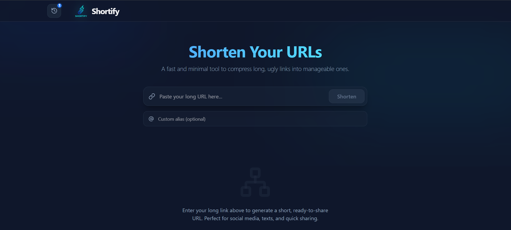
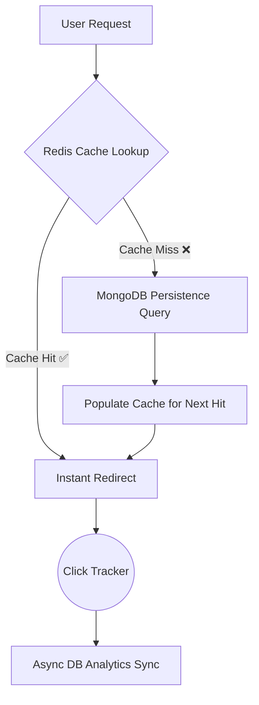

<div align="center">
  
  
  <br />

  [](https://typescriptlang.org)
  [](https://react.dev)
  [](https://tailwindcss.com)
  [](https://redis.io)
  [](https://mongodb.com)
 

  <h3>Transform long, messy links into powerful, branded, and trackable short URLs.</h3>
  
  <p>
    <a href="https://aditya-dev-portfolio-iota.vercel.app/"><b>✨ View My Portfolio</b></a> • 
    <a href="https://github.com/Adityamkumar"><b>🔗 Github Profile</b></a> • 
    <a href="#-installation--setup"><b>🚀 Get Started</b></a>
  </p>
</div>

---

## 💎 The Premium Experience

**Shortify** is designed for those who value speed and aesthetics. Every detail—from the glassmorphic sidebar to the spring-physics animations—is crafted to provide an elite user experience.

- **⚡ Instant Response**: Redirection logic optimized with Redis caching for near-zero latency.
- **🏷️ Branded Links**: Stand out with custom aliases that speak your brand's language.
- **📊 Deep Analytics**: Real-time click tracking with visual "🔥 Popular" highlights for viral links.
- **🎨 Modern Dark UI**: A sophisticated design system using Tailwind 4's latest capabilities.
- **🛡️ Secure History**: Local persistence ensures your history stays private yet always accessible.

---

## 🧠 High-Performance Caching Architecture

Shortify uses a multi-layered caching strategy. By offloading 99% of redirection traffic to memory, we protect the primary database and provide a seamless experience to the end user.



### Why Redis?
- **Speed**: Memory-level access reduces TTFB (Time to First Byte) significantly.
- **Efficiency**: Reduces server load by avoiding redundant expensive database lookups.
- **Scalability**: Handles thousands of concurrent redirects without sweating.

---

## 🛠️ Technology Stack

| Layer | Technology | Purpose |
| :--- | :--- | :--- |
| **Frontend** | React 19 + TypeScript | Type-safe, high-performance UI components. |
| **Styling** | Tailwind CSS 4.0 | Next-gen utility-first CSS for elite aesthetics. |
| **Animations** | Framer Motion | Fluid "sproing" animations and layout transitions. |
| **Backend** | Express + Node.js | Fast, scalable asynchronous API server. |
| **Database** | MongoDB | Robust storage for link metadata and persistent stats. |
| **Caching** | Redis | High-speed, in-memory redirection engine. |

---

## 🚀 Installation & Setup

1. **Clone the Repo**
   ```bash
   git clone https://github.com/Adityamkumar/Url_Shortner.git
   ```

2. **Frontend Configuration**
   ```bash
   cd frontend
   npm install
   # Create .env and set VITE_API_URL=http://localhost:8000/api/v1
   npm run dev
   ```

3. **Backend Configuration**
   ```bash
   cd ../backend
   npm install
   # Create .env and set MONGO_URI, REDIS_URL, and PORT
   npm run dev
   ```

---

<p align="center">
  Developed with ❤️ by <a href="https://aditya-dev-portfolio-iota.vercel.app/">Aditya</a>
</p>
